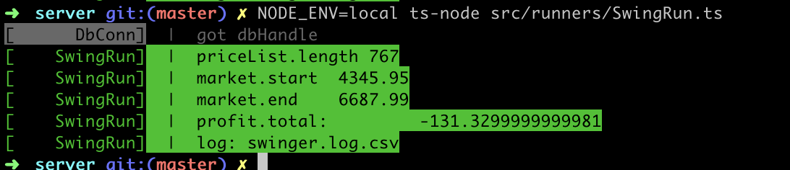
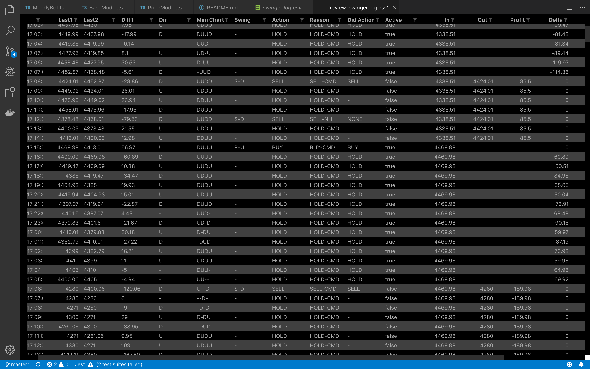

# Trader SimBot

Simple crypto trading bot simulator, running against Bitcoin market historical data.
You can create change configuration variables, or create your own bot with deeper strategies.

## requirements
node, typescript, mongoDB

also `ts-node` for running scripts at the cmd-line:

    npm i -g ts-node

## config

    cd server
    cp src/config/local.env.example src/config/local.env

edit local.env to add these keys if you want to use realtime Binance market data.
The bot does NOT currently do any trades, but in any case you can create an API key that only has 'read' capability

    BinanceApiKey=YOUR_API_KEY_HERE
    BinanceApiSecret=YOUR_API_SECRET_HERE

Otherwise just leave the keys out, we can also run against historical downloaded data.

## install

    cd server
    npm i


## Gettting data to work with
Get some historial BTC-USD price data

note: there's already some data in the repo, but this will load latest data.
you'll want to run this script to load it into mongoDB though.

    src/scripts/get-binance-data.sh

this will download some CSV data, and load into a local mongoDB

## Running a test bot
Using `ts-node` to run typescript at the command line from 'server' directory. If you use `nodemon` it will rerun on each code edit.

The `runners` folder contains some bots run with different configs.

    ts-node src/runners/SwingRun.ts

you'll get something like this:

```
$ NODE_ENV=local ts-node src/runners/SwingRun.ts
[      DbConn]  |  got dbHandle
[    SwingRun]  |  priceList.length 767
[    SwingRun]  |  market.start	 4345.95
[    SwingRun]  |  market.end	 6687.99
[    SwingRun]  |  profit.total:	 -131.3299999999981
[    SwingRun]  |  log: swinger.log.csv
```



So, obviously not a good trading strategy!
It lost **$131** even though the market went up by nearly $2342 in the same period.

767 prices ~= 31 days (binance historical data is at hourly intervals)

Well, its just a basic bot without much strategy or signals yet.
But this simple framework allows other ideas to be tested.

note: at this time the bot just buys 1BTC each tx, no matter what the price.

## Basic how it works:
The MoodyBot (mood swings geddit?) just trades on basic swings, with no awareness of pressure/resistance/volume or any other technical indicators (coming soon!)

If you look into `SwingRun` you'll see:

The DateRange:

```
  let finder = {
    date: {
      $gte: new Date("2017-10-01T00:00:00.000Z"),
      $lte: new Date("2017-11-01T23:00:00.000Z"),
    }
  }
```

the Bot Config:
```
const config: IBotConfig = {
  logfile: 'swinger.log',
  calcConfig: {
    stepDown: 10,
    stepUp: 5
  }
}
```

This is passed into the very simple bot `MoodyBot`.
`stepDown/Up` is a setting for how many (USD) the bot will consider a change of 'direction'.
Down can be bigger than up as often drops are sharper than rises.
If a pattern of directional change is recognized it will trigger a 'swing'.

A 'swing' is defined in `Kalk.ts` eg:

```
public calcSwing(miniChart: string): string {
  let sw = '-'
  if (/DDUU$/.test(miniChart)) sw = 'S-U' // swing up
  if (/UU$/.test(miniChart)) sw = 'R-U' // run up
  if (/UDD$/.test(miniChart)) sw = 'S-D'
  if (/DD$/.test(miniChart)) sw = 'R-D'
```


Then later the `U` or `D` triggers a `BUY/SELL` action.
Of course these rules can overlap and apply based on order. So a `UUDD` SwingDown would also get caught on a `DD` run-down.

So if the bot sees `DDUU` two down ticks followed by two up-ticks it will treat this as a swing up `S-U`.
We also check for some other `DDD` meaning a run going down `R-U`

The samples run at the same rate as the data being fed in.

So based on these swings the bot will call an `action`

## Viewing results
You can see more details of the trading log in a csv file eg `logs/swinger.log.csv`

As the trader sim runs it writes logs here.



(viewing the CSV file with a VScode plugin)
The date formats are compatible with google docs if you want to import and see graphs.

Columns:
- diff1 - difference last two prices
- dir - up/down related to diff1
- total - current running profit

## TODO
- more modular strategies
- Add more technical analysis types (tulip)
- Client to visualize trades in graph format
- Profitable bot strategy :D

Please get in touch if you'd like to help out!
dc AT rikai.co
